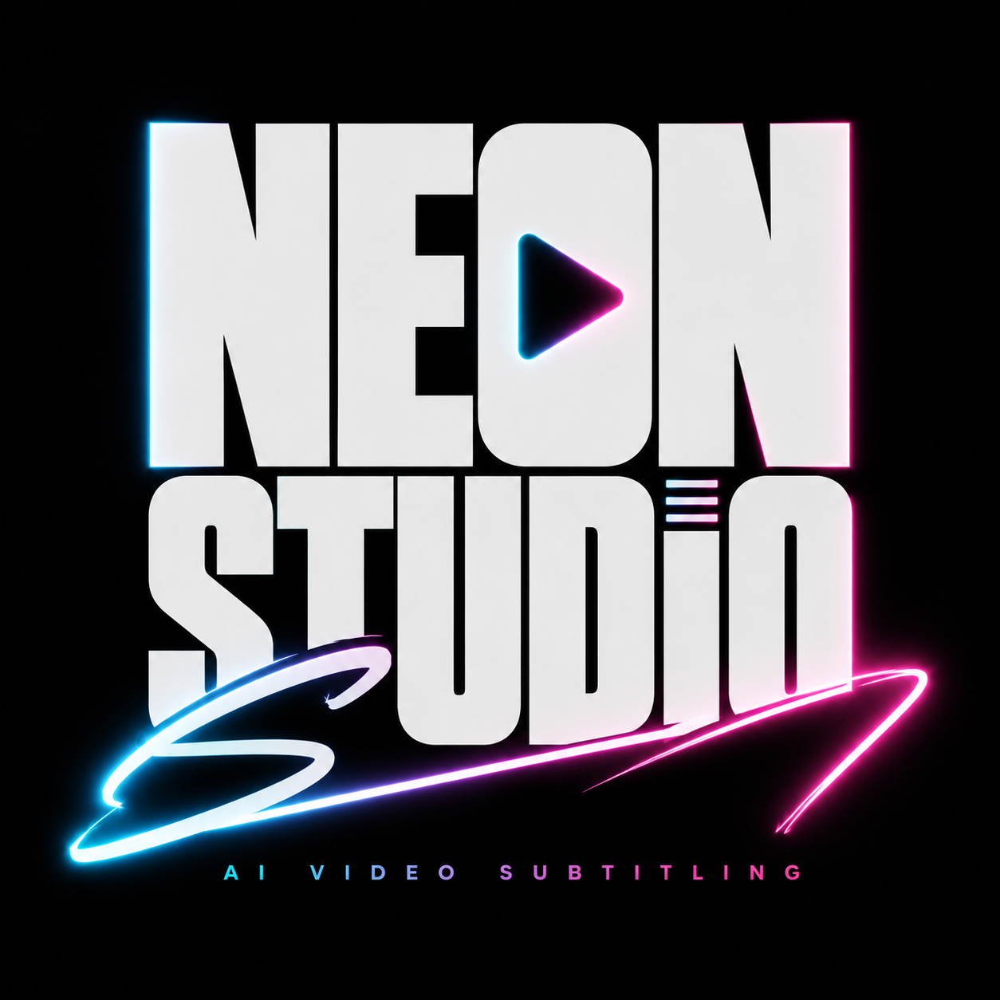
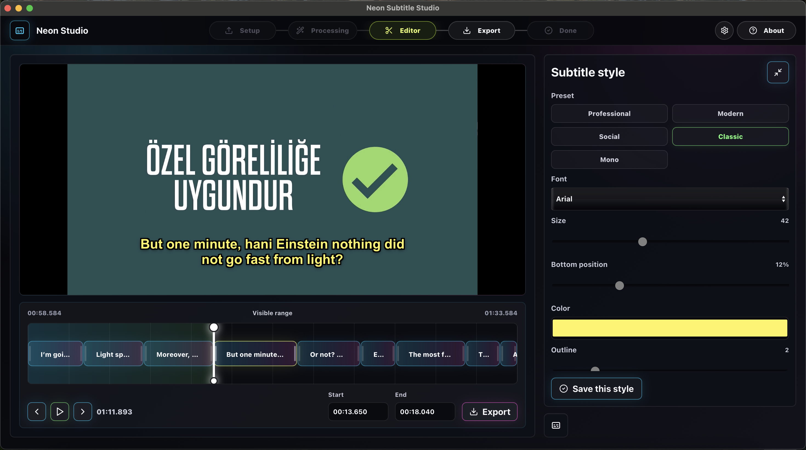

# Neon Subtitle Studio

Full offline desktop subtitle studio. The current production bundle target is macOS; Windows packaging needs a Windows engine sidecar and whisper.cpp binary before it is enabled again.



## What is implemented

- Tauri 2 project scaffold.
- React + TypeScript + Vite frontend.
- Dark professional studio UI with neon blue, green, yellow, and pink action accents.
- Dashboard, Import, Studio, Export History, Settings, and offline engine status surfaces.
- Python sidecar engine with local HTTP API.
- SQLite autosave/job database.
- Offline asset manifest and health checks.
- Chunk/resume-ready job status flow.
- SRT/VTT export path from editable subtitle segments.
- macOS DMG packaging with bundled assets and engine sidecar.
- Engine lifecycle cleanup on app start and app exit.

## Preview



## Local development

Install dependencies:

```bash
npm install
```

For browser-only UI development, run the Python engine in one terminal:

```bash
npm run dev:engine
```

Then run the Vite UI in another terminal:

```bash
npm run dev
```

Open `http://localhost:1420`.

For full desktop development, run Tauri:

```bash
npm run tauri dev
```

The Tauri app starts the bundled engine sidecar automatically.

## Engine lifecycle

The desktop app owns the engine process lifecycle:

- On app startup, stale engine listeners on port `43187` are cleaned up before a new sidecar starts.
- On app exit, the managed sidecar and any stale engine processes are terminated.
- Temporary chunk files under the app data directory are cleaned on startup, shutdown, and interrupted jobs.

This is especially important for packaged DMG builds, where the app must not leave a running engine or partial temp files behind after closing.

## macOS DMG build

Build the production macOS bundle with:

```bash
npm run tauri build
```

The generated DMG is written under:

```text
src-tauri/target/release/bundle/dmg/
```

Distribution copies can be placed under `release/`, but `release/` is ignored and should not be committed.

## Offline production assets

Large binaries are intentionally not committed. Before production packaging, add:

- `assets/models/whisper/ggml-large-v3-turbo-q8_0.bin`
- Argos Translate packages under `assets/translate/argos`
- FFmpeg binaries under `assets/ffmpeg`
- Frozen or packaged Python sidecar binaries under `src-tauri/binaries`

See `docs/offline-assets.md`.

## Generated files

The following local build/runtime folders are ignored and should stay out of Git:

- `build/`
- `dist/`
- `release/`
- `.neon-data/`
- `src-tauri/target/`
- `node_modules/`
